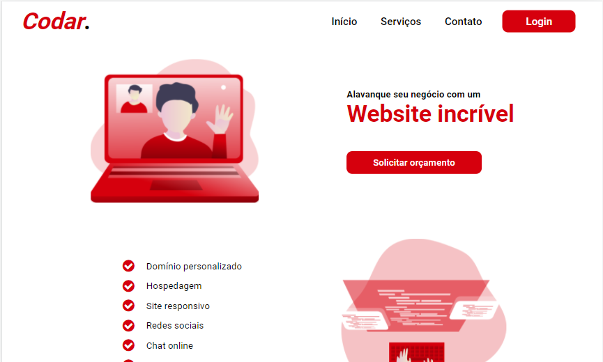

 

  

  <h3 align="center">Codar.</h3>

  

    Site de uma empresa que desenvolve sites
        
     
  

## Índice

- [Descrição](#descrição)
- [Techs](#techs)
- [Dicas](#dicas)
  - [Cores](#cores)
  - [Modelo](#modelo)
  - [Imagens](#imagens)
  - [Tipo de fonte](#tipo-de-fonte)
- [Compartilhe](#compartilhe)

# Descrição

Resultado do desafio proposto por <a href="https://devchallenge.now.sh/"> DevChallenge</a> no qual consiste em criar uma página sobre uma empresa que desenvolve sites.

  

# Techs:

HTML 
CSS

# Requisitos:

- Sua página deve se parecer o mais próximo possível ao modelo que está disponível na pasta "design" 
- Sua página deve ser responsiva

# Dicas

## Cores:

Vermelho: #D6000D

## Modelo:

O modelo está disponível na pasta `./design` 

## Imagens

As imagens utilizadas estão disponíveis na pasta `./assets` 
Para os ícones, é recomendada a utilização de uma biblioteca, como o Font Awesome

## Tipo de fonte:

- Roboto

# Compartilhe!

Inicie seu projeto utilizando esse template no seu github como um repositório público 
Faça um print, gif ou vídeo e compartilhe o resultado no seu Linkedin 

Criado por <a href="https://github.com/Lorenalgm">Lorena</a> :)
